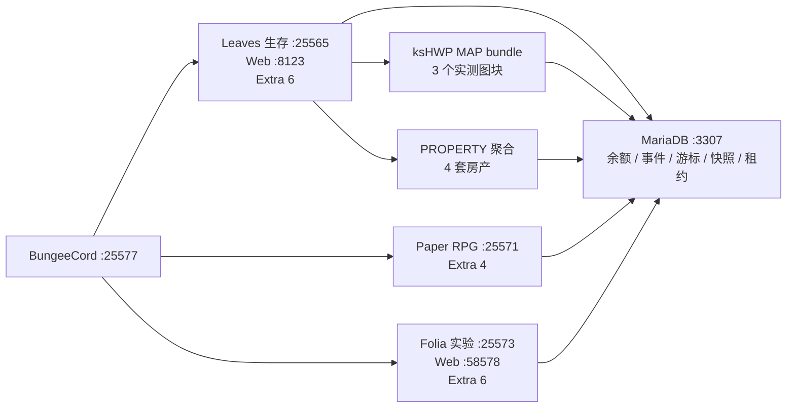

# ks-Eco 全功能与三端兼容验收报告（2026-07-23）

验证时间：2026-07-23 01:52（Asia/Hong_Kong）

## 结论

本轮源码构建、静态资源、共享 MariaDB、Leaves、Paper、Folia、BungeeCord、跨服 MAP/PROPERTY 投影和普通版/Folia 同口径 Web API 验收均通过。最终状态为：23/23 Maven 模块成功，391 项测试无失败；Leaves 与 Folia 各 29 项 HTTP 合同均返回预期状态；三端 `ks-Eco` 均运行跨服 runtime，Folia 已加载全部 6 个当前经济 Extra，启动日志无 ks-Series ERROR 或区域线程异常。

这里的“通过”不等于生产验收。没有在线真实玩家参与资金、背包、GUI、跨服切换或崩溃注入；明确限制见本文末尾。

## 实测拓扑

## 编译矩阵

全仓先按依赖顺序执行 `clean install`；之后仅对发生收口修复的模块执行定向 `clean test package`，没有重复整轮审计。

| 模块 | 构建 | 测试数 | 结果 |
|---|---:|---:|---|
| `KS-ItemEditor` | 成功 | 0 | 通过 |
| `KS-ItemSteal` | 成功 | 0 | 通过 |
| `ks-BossCombat` | 成功 | 0 | 通过 |
| `ks-BotGuard` | 成功 | 2 | 通过 |
| `ks-Cinematic` | 成功 | 0 | 通过 |
| `ks-Compat` | 成功 | 0 | 通过 |
| `ks-Eco` | 成功 | 196 | 通过 |
| `ks-Eco-RealEstate` | 成功 | 14 | 通过 |
| `ks-Eco-RealEstateDungeon` | 成功 | 29 | 通过 |
| `ks-Eco-bank` | 成功 | 52 | 通过 |
| `ks-Eco-enterprise` | 成功 | 4 | 通过 |
| `ks-Eco-politic` | 成功 | 16 | 通过 |
| `ks-Eco-tax` | 成功 | 7 | 通过 |
| `ks-Inherit` | 成功 | 0 | 通过 |
| `ks-InstanceWorld` | 成功 | 11 | 默认版与 Folia 版均通过 |
| `ks-Maintenance` | 成功 | 0 | 通过 |
| `ks-RPG` | 成功 | 45 | 通过 |
| `ks-RPG-Gui` | 成功 | 0 | 通过 |
| `ks-Sentinel` | 成功 | 0 | 通过 |
| `ks-Skill` | 成功 | 3 | 通过 |
| `ks-Title` | 成功 | 0 | 通过 |
| `ks-core` | 成功 | 9 | 通过 |
| `ksHWP` | 成功 | 3 | 通过 |
| **合计** | **23/23** | **391** | **0 failure / 0 error / 0 skipped** |

### 静态检查

| 检查 | 结果 |
|---|---:|
| 外部 Web JavaScript | 22/22 |
| 严格源 YAML | 341/341 |
| 插件入口 | 17/17 |
| HTML 本地资源引用 | 25/25 |

残余构建警告仅包括 JDK native-access、Mockito 动态 agent、SLF4J NOP，以及测试故意触发的队列拒绝/缺失驱动日志；均未造成测试失败。

## 三端运行时

| 节点 | 软件 | Extra | Web 合同 | 跨服状态 | 启动/重载 |
|---|---|---:|---:|---|---|
| `survival` | Leaves 1.21.11 | 6 | 29/29 预期状态 | ready | `Done`，`status/reload/list` 成功 |
| `rpg` | Paper 1.21.11 | 4 | 按角色关闭 Web | running | `Done`，`status/reload/list` 成功 |
| `folia` | Folia 1.21.11 | 6 | 29/29 预期状态 | ready | `Done`，`status/reload/list` 成功 |

每个 Web 节点的 29 项合同由 27 个 HTTP 200、1 个未认证管理员接口 HTTP 401、1 个缺少必填 `bankId` 的存款产品请求 HTTP 400 组成。后两项是预期的鉴权/参数拒绝，不是失败。覆盖市场、宏观数据、挂单、启动数据、银行、企业、税、盲盒、地产、结算复核和跨服查询。

最终监听端口 9/9：MCSM `23333`、daemon `24444`、MariaDB `3307`、BungeeCord `25577`、Leaves `25565`、Paper `25571`、Folia `25573`、Leaves Web `8123`、Folia Web `58578`。

## 地图、地产与跨服资产

| 场景 | 实测结果 |
|---|---|
| 售楼沙盘 | 4 个区域可查询；示范城区清单返回 4 栋建筑、1 个地块 |
| 沙盘渲染合同 | `BUILDING_ASSEMBLY`、异步、预渲染均开启 |
| PROPERTY 来源 | `survival/test_world/minecraft:overworld` |
| PROPERTY 聚合 | 4 个不同资产、数量 4、总展示价 375,000,000 最小货币单位 |
| MAP 来源 | `survival/test_world/minecraft:overworld` |
| MAP bundle | `ks-hwp-map-tile-bundle/v1`，3 个不同图块，非 stale、非 offline |
| 世界策略 | MAP、PROPERTY、资产汇总默认拒绝后按 allow 开放；`world_private` 位于 deny，deny 优先 |
| 跨服转移 | 保持关闭，未伪装成已完成 |

实机过程中修复了两条只在重启后暴露的问题：READY 信封中可空字段导致房产快照 NPE；HWP 命中本地图块缓存时没有重新喂给跨服 bundle。两者修复后分别稳定得到 4 套房产和 3 个地图图块。

## Folia 专项

- `ks-core`、`ks-Eco`、`ks-InstanceWorld` 使用独立 Folia profile 构建；部署文件名统一，但 JAR 元数据声明 `folia-supported: true`。
- 银行、企业、政治、税务、地产、副本 6 个 Extra 均加载；旧的 BukkitScheduler、`isPrimaryThread` 和同步跨区传送路径已从本轮适配范围移除。
- `ks-InstanceWorld` 在没有 WorldEdit/FAWE 时仍启用并注册 API；schematic 准备/清理在功能级失败关闭。
- 修复 Extra 启用期注册 schematic root 被错误要求 global tick thread 的问题；真正的 prepare/release 仍保留 global owner 约束。
- 清理并索引备份了 Folia 目录中旧的重复 `*-folia.jar`，最终启动日志不再出现插件名歧义。

## 部署与备份

所有替换均使用 `scripts/deploy-plugin.ps1`，制品与目标 SHA-256 一致，旧 JAR 只进入 `backup/<plugin-id>/` 并追加 `index.jsonl`。关键最终目标包括：

| 节点 | 目标 | SHA-256 |
|---|---|---|
| Leaves | `ks-Eco-1.1.0.jar` | `5C0329AED37289FE3095EE5B9FB8937F470CBDC113CCE8814181E71E54252152` |
| Leaves | `ks-InstanceWorld-0.1.0.jar` | `6090C4D86B9EF84A22992F51CAE733A3545261A7D86C9E18BEFDAACC657B2D86` |
| Leaves | `ks-Eco-RealEstate-1.1.0.jar` | `48D1A3A9B48C96DDC82FBE5D0AA05EAD5C2FDDA7579828D37282DC559BC163C3` |
| Leaves | `ksHWP-1.1.0.jar` | `C2F57989077E0740BCFC8519D2EA1A801FF5A048A97B000A485B74DEB9B19ECB` |
| Paper | `ks-Eco-1.1.0.jar` | `05521748E23D51E161A5B7476C78811E173C836C76C8C199E56B7DAD1C476D13` |
| Paper | `ks-InstanceWorld-0.1.0.jar` | `016557FE88925F287AC27BAE24D4AF1983E2AC86D2D2E2B10535DD7F2243E1ED` |
| Folia | `ks-Eco-1.1.0.jar` | `0771D0F0A60D7CDA0953B091B04992588B25A041A94B352DC764FFA4712F51F0` |
| Folia | `ks-InstanceWorld-0.1.0.jar` | `587E3DD642A8E99A68AEEF939E6EC6751F8C52B8FB562C17A044EA9393F49ABB` |

## 明确限制

- 本轮真实数据库是 MariaDB；没有连接真实 MySQL/PostgreSQL，也没有执行外部远程存量库迁移或生产锁压力。
- 测试时三端均为 0 名真实玩家。Web 和服务 API 已实操，但玩家背包 GUI、Vault 扣款、跨服切换、并发成交和崩溃窗口仍需要真人验收。
- Folia 实验端没有 FAWE/WorldEdit 和 MythicMobs；副本 Extra 能加载，无法据此宣称 schematic 粘贴、Boss 生成或完整副本流程已在 Folia 通过。
- 非 `CASH` 玩家结算、通用 ASSET 业务生产者、跨服传送和其他未 journal 化外部窗口仍未完成。
- 当前 MAP 是有界滚动图块 bundle，会随实际浏览恢复，不是完整世界离线归档。
- Leaves 的 PlaceholderAPI、MMOItems/MMOCore 示例配置和外部更新检查仍有非 ks-Series 网络/内容警告；没有禁用本轮 ks-Series 模块。
- 本轮 Codex 内置浏览器发生异常退出，最终 Web 验收采用真实 HTTP/API、资源静态检查和服务日志；没有把这等同于真人鼠标逐按钮视觉回归。
