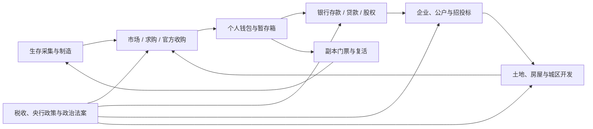

# ks-Eco 系列玩法白皮书

> 版本基线：2026-07-22 ｜ 适用范围：`ks-Eco` 与六个经济 Extra ｜ 本轮仅维护中文版

## 摘要

ks-Eco 不是一个单纯显示余额的插件，而是一套围绕 Minecraft 生存资源建立的可组合经济玩法平台。它把玩家采集、制造、交易、储蓄、融资、企业经营、土地开发、副本冒险、税收和政治决策连接成同一个循环，同时保留各模块独立启停的能力。

当前可见玩法可以概括为七条主线：

1. 玩家通过采集、生产、市场、官方收购、限时商店和盲盒获得或流转资源。
2. 交易所得可以进入商业银行活期、定期存单、股权投资或贷款体系。
3. 玩家可以成立企业，以独立公户参与招投标、房产经营、融资和分红。
4. 玩家或企业可以买地、登记房屋、建设城区、浏览 3D 售楼沙盘并交易建筑产权。
5. 队伍可以支付门票进入独立副本，承担时间、死亡和递增复活费风险，获取完成奖励。
6. 税率、央行政策和政治法案构成服务器宏观调控层。
7. 暂存箱、结算日志、条件认领和人工复核负责处理背包已满、重复点击、服务器重启和外部钱包结果未知等边界。

这套系统的目标不是制造无限货币，而是让生存资源、信用、土地、组织能力和战斗能力都能成为可经营的资产。

## 一、产品定位

### 1.1 核心设计原则

- **生存资源是价值起点**：原版和定制物品仍来自采集、制造、活动与副本，而不是由网页凭空生成。
- **玩家定价与官方流动性并存**：玩家市场负责自由价格发现，官方收购负责为指定资源提供有限的基础流动性。
- **资金用途分层**：个人钱包、银行账户、企业公户、项目托管、拍卖 escrow 和保险基金有不同所有权，不能互相冒充。
- **风险必须有代价**：贷款有信用和抵押约束，副本有门票和复活成本，企业项目有保证金，房地产有价格与持有限制。
- **模块可以缺席**：银行、企业、税、地产、副本和政治都是 Extra；其中一个模块失败不应拖垮市场和基础经济。
- **异常可解释**：正常失败应退款或恢复库存；无法自动证明的钱包结果进入人工复核，而不是猜测成功或失败。

### 1.2 经济循环

市场提供价格发现，银行把闲置资金转成信贷，企业组织大额项目，地产提供长期资产，副本提供高风险资源产出，税收与政治负责调整整个循环的速度和成本。

## 二、模块全景与当前状态

| 模块 | 玩家价值 | 当前状态 |
|---|---|---|
| `ks-Eco` | 市场、交易、求购、官方收购、动态价格、盲盒、限时商店、暂存、补偿 | 已部署；核心链路可用 |
| `ks-Eco-bank` | 活期/定期、信用贷款、实物抵押、展期、股份、分红、保险和清算 | 已部署；玩家与管理员 Web 已实测 |
| `ks-Eco-enterprise` | 企业注册、公户、成员治理、招投标、保证金、预付款、分红 | 已部署；核心资金链已实现，完整工程履约仍在扩展 |
| `ks-Eco-tax` | 交易税、企业税、利息税、分红税、行业与阶梯税率 | 已部署；税率可配置，部分外部钱包故障仍需人工边界 |
| `ks-Eco-RealEstate` | 区域、地块、保护、信任、房屋登记、交易和 3D 售楼沙盘 | 已部署；城区沙盘与玩家/管理页面已实测 |
| `ks-Eco-RealEstateDungeon` | 组队、门票、实例、副本房产、付费复活和完成奖励 | 已部署；持久结算已实现，重启重建仍是验收边界 |
| `ks-Eco-politic` | 职位、选举、提案、表决、否决、覆议与立法门控 | 已部署；代码与测试通过，正式政治赛季仍由服主决定开放 |

## 三、基础经济与交易玩法

### 3.1 玩家市场

玩家可以把完整物品挂到市场，由其他玩家按挂单价格购买。系统保留物品名称、Lore、附魔、属性、模型数据、PDC 和潜影盒内容，不把定制装备退化成普通 Material。

成交过程不是简单的“扣钱后发物品”，而是依次记录买家扣款、库存认领、隐藏暂存、卖家入账和买家交付。在卖家入账确认前，物品以隐藏状态保存，不能提前领取或被过期清理；确定失败会恢复库存或退款。

玩家可以形成以下职业路线：

- 资源商：批量采集基础材料并靠高周转获利。
- 制造商：把原料加工成带属性、Lore 或模型的高价值物品。
- 套利商：观察官方价、玩家挂单和限时活动之间的价格差。
- 收藏商：交易稀有盲盒产物、副本奖励和定制装备。

### 3.2 求购订单

买家可以用求购表达“愿意用什么价格收多少物品”。履约时系统预留数量和物品，资金与物品结算完成后才向买家开放；取消、并发履约或部分成交不会让同一份库存被重复领取。

求购适合矿物、农产品、活动材料和企业长期原料采购，为生产者提供比等待挂单更明确的销售出口。

### 3.3 官方收购与动态定价

官方收购只接受配置中的指定资源，为难以找到买家的基础产物提供流动性。价格引擎结合实际官方交易、供需压力、市场均价和均值回归更新价格，而不是按固定随机数跳动。

这使服务器可以设计周期：某种资源大量出售后收购价逐步承压；供给不足或市场价格上升时，相关资源的收益重新改善。管理员仍可设置保护价和强制价格，但玩家真实交易是主要信号之一。

### 3.4 玩家面对面交易

`/trade <玩家>` 提供双方确认的物品与货币交换。它适合不希望公开挂单的定制物品、团队内部交易或大额协商交易。

### 3.5 暂存箱与物流兜底

`/storage` 是整个经济的交付缓冲区。市场购买、退回物品、盲盒奖励、限时商品和补偿在背包空间不足时进入暂存，而不是掉落或消失。

因此，暂存箱不是额外仓库玩法，而是经济结算的最后一道物品安全边界。

## 四、盲盒、限时商店与补偿

### 4.1 盲盒

玩家可在经济 GUI 或 Web 查看奖池、价格、稀有度、奖品预览、抽取历史和个人保底进度，并执行单抽或十连。

- 每个奖品具有权重和稀有度。
- 长时间未获得高稀有度奖励时，保底进度持续保存。
- 命中指定稀有度后按奖池规则重置计数。
- 奖励保留完整物品数据，背包满时进入暂存箱。
- 企业盲盒从企业公户支付，并可要求企业等级和相应权限。

盲盒适合作为收藏和活动玩法，不应替代所有正常生产。奖池稀有物品仍需要和市场、生产、副本产出保持可解释的价值关系。

### 4.2 限时商店

`/limitedsale` 提供固定价格、总库存、时间窗和个人限购商品，也可以出售绑定奖池的限时盲盒。

玩家可以购买单份、批量或整盒。购买前会同时检查开售时间、剩余库存、个人额度和余额；异常时恢复库存并退款。限时商店适合节日材料、礼包、稀缺装饰和限量奖池。

### 4.3 服务器补偿

补偿用于维护补发、事故处理和活动奖励。每个方案有有效期和每人一次的领取记录，物品统一进入暂存箱。补偿不参与市场供需，也不应被当作常规商品销售渠道。

## 五、银行与金融玩法

银行已经从“存取款菜单”扩展为可经营、可融资、可收购、可处置的完整玩法域。

### 5.1 活期与定期存款

玩家可以在商业银行开立活期账户，存款、取款并获得按周期内加权平均余额计算的利息。频繁在结算前临时转入资金不会获得整周期利息。

定期产品包括 7、30、90 日定期和 180 日大额存单：

- 开立时从所选银行活期账户转入本金。
- 到期可以赎回或自动续存。
- 提前支取只损失部分或全部未到期利息，不侵蚀本金。
- 活期计入 M1，有效定期进一步计入 M2。

### 5.2 信用、产品贷款和正式报价

银行根据已结清记录、在贷金额、当前/历史逾期和近期申请计算 A-E 信用等级。信用等级影响可贷额度、最长时间和风险加点。

现有四类贷款：

| 产品 | 主要用途 | 抵押规则 |
|---|---|---|
| 消费信用贷 | 小额周转、消费 | 无实物抵押，以信用和额度为主 |
| 住房抵押贷 | 购买或开发住宅 | 本人地块或房屋，最高 75% LTV |
| 经营周转贷 | 个体经营、生产扩张 | 本人地块或房屋，最高 60% LTV |
| 项目履约贷 | 已中标项目执行 | 本人中标合同，最高 70% LTV |

贷款支持到期还本付息、等额本息和等额本金。玩家先获取带有效期的正式报价，再按该报价申请，避免审批期间利率被无提示替换。

### 5.3 抵押、逾期和拍卖

抵押物在申请时预占，放款后锁定，结清后释放。抵押中的地块或房屋不能再次挂牌；房屋与其父地块会一起检查，不能用不同资产类型绕过锁定。

超过宽限期的贷款会进入违约，抵押物生成拍卖：

- 竞价资金进入持久 escrow。
- 被超价的竞拍者可以安全退款。
- 成交会结算银行资产并交割抵押物。
- 流拍会按折价规则重新挂牌。

借款人也可以申请 7、14 或 30 日展期。银行审批后会增加明确费用、更新到期日并重建还款计划；展期不是无成本免除违约。

### 5.4 商业银行经营

银行经营者可以观察：

- 流动性与存款负债。
- 贷款资产、逾期和坏账。
- 资本率、流动性比率和损失准备。
- 利息收入、存款利息成本和留存收益。
- A-E 经营评级和 `NORMAL/WATCH/RESTRICTED/RESOLUTION` 状态。

这形成了真实的经营取舍：存款利率太低会失去资金，太高会增加成本；贷款扩张可以提高收益，但会压低流动性并增加违约风险。

### 5.5 银行股权、收购和分红

商业银行拥有授权股本、已发行股本和逐股东持仓。

- 银行可以发行新股进行一级增资。
- 股东可以在二级市场挂牌、成交或撤单。
- 待售股份会预留，不能同时卖给多人。
- 分红按实际持股比例精确分配。
- 重要股东和控制股东会同步到银行所有权。
- 受限、处置中或已清算银行不能继续交易股份。

玩家由此可以选择不亲自经营银行，而是成为金融投资者，通过判断银行资产质量、评级和政策环境获得股息或控制权。

### 5.6 存款保险与桥接清算

商业银行按月向保险基金缴费。保障按每名存款人合并活期和有效定期计算，每人最高 100,000。

当银行进入 `RESOLUTION` 后，管理员可以先预览：

- 存款总额与存款人数。
- 可回收资产价值和回收率。
- 受保存款缺口与保险基金补助。
- 未保险部分的折损。
- 桥接银行需要承接的账户、贷款、抵押物和拍卖。

执行清算是不可逆操作，失败银行的业务会原子迁移到正常桥接银行，并保留逐存款人记录。当前测试服只验证了预览、页面和数据库流程，没有对真实业务存量执行不可逆清算。

### 5.7 央行玩法

央行可以调整基准利率、准备金率、商业银行利率走廊和开行最低资本，提供带负债记录的流动性贷款，并发布利率、流动性、房地产、违约潮和存款竞争事件。

政策事件只影响后续报价与风险环境，不直接凭空修改玩家余额。央行还可以把问题银行置于观察、限制新增业务或处置状态。

## 六、企业与招投标玩法

### 6.1 企业作为独立经济主体

玩家可以注册私营或国有企业，设定名称、法人和注册资本。注册资本从所有者资金中真实扣除，企业拥有独立公户，不与成员个人钱包混用。

企业支持：

- 加入申请与管理者审批。
- 角色和独立权限。
- 成员主动退出、管理者移除和所有者约束。
- 在没有活动贷款或待处理申请时解散。
- 企业等级、行业、地区和状态。
- 按成员份额分红，并记录税额与逐人结果。

企业等级可以影响企业盲盒资格和企业地块福利，使长期经营结果产生非现金价值。

### 6.2 项目发布与投标

项目可以设置预算、预付款比例、保证金、罚金比例、截止时间、位置和资质条件。

- 企业发布方会从公户预留预付款到项目托管。
- 投标企业通常需要达到注册资本资格线。
- 官方或国企项目使用价格、资质和时效综合评分。
- 私企可以自主选择中标人，也可以采用综合评分。
- 配置保证金时，中标人在确认前必须完成保证金结算。
- 企业保证金、公户 escrow 和企业预付款在同一数据库事务内提交。
- 个人中标时，保证金和预付款通过持久钱包结算日志恢复或人工复核。

### 6.3 联合体、分包和企业房产

项目支持联合体与分包基础，使大型订单不必由单一企业独占。拥有 `MANAGE_PROPERTY` 权限的企业成员可以管理企业房产；成交款进入企业公户及开户行镜像，不会落入操作成员的个人钱包。

### 6.4 当前工程边界

项目发布、投标、保证金、预付款和中标资金链已经形成。完整的里程碑验收、分阶段交付、尾款、自动违约处罚和项目完成结算仍在后续范围；旧游戏内评标入口因缺少可证明托管而继续失败关闭，推荐使用 Web 路径。

## 七、税收与宏观调节

税务模块允许不同经济行为使用不同税种，而不是所有交易统一扣一个比例。

现有税务能力包括：

- 玩家市场交易税。
- 官方交易税。
- 小型、中型和大型企业阶梯税。
- 行业差异化税率。
- 银行利息税。
- 玩家转账税。
- 分红税。
- 罚金与违约相关税费。

管理员可在 Web 调整税率。税率兼容小数和旧百分比存储，并保留审计记录。税收的玩法意义是定向调节：例如提高过热行业成本、鼓励官方回收、控制高收益金融活动，而不是单纯消灭玩家资金。

当政治模块开启立法门控后，部分税率与政策不再允许管理员直接随意修改，而需要经过提案和表决流程。

## 八、房地产与城区经营

### 8.1 区域、地块与规划

管理员先划定区域，设置世界、规划类型、基础价格或每方块价格、最低成交价、税率、容积率和面积限制。玩家或企业在 Web 地图中框选地块购买。

- 新区域可以按面积计价，旧区域保留固定价格兼容。
- 单地块有面积上限。
- 玩家与企业有软、硬持有面积限制。
- 超过软限会线性加价，超过硬限直接拒绝。
- 副本临时地块不计入主世界长期持有面积。

个人地块按所有者和信任名单保护；企业地块按企业成员权限保护。保护覆盖破坏、放置、容器、互动和爆炸。

### 8.2 房屋登记与产权

买地获得土地使用权，登记房屋才形成独立建筑产权并消耗区域容积率。

玩家使用 `/house wand` 选择三维边界，随后登记房屋。系统检查房屋是否位于可管理地块内、是否与已有建筑冲突以及区域是否仍有容积率。

登记后的房屋可以挂牌出售。成交转移房屋产权并结算产权转移税，不会自动转移整块土地。个人卖款通过钱包结算日志处理；企业房屋卖款进入企业公户。

### 8.3 3D 售楼沙盘

玩家在 Web 地产地图选择区域后，可以进入城区级 3D 售楼沙盘：

- 多栋建筑按真实世界位置组合成一个城区，而不是逐栋孤立预览。
- 道路、地块和建筑占位先显示，楼栋体素随后异步加载。
- 单栋建筑使用预渲染缓存，后台裁剪隐藏方块，减少传输和绘制负担。
- 每栋房屋有特殊标识和侧边目录。
- 点击楼栋会聚焦建筑，并显示售价、正式挂单价、大小、占地、体积、状态和地块信息。
- 支持正交等距视角、旋转、平移、缩放、键盘移动和视角复位。

测试服已建成四栋房屋的小型示范城区，并完成玩家端浏览、楼栋聚焦、房源卡和管理端区域查看实测。

### 8.4 地产与银行联动

地块和房屋既是可交易资产，也是住房贷和经营贷抵押物。挂牌、抵押、成交和违约拍卖共享冲突检查：同一资产不能同时卖出、抵押给多家银行或被并发转移。

这让房地产不只是领地保护，而是城市开发、租售预期、企业资产和银行信用之间的连接层。

## 九、副本经济玩法

### 9.1 队伍与开本

`/dungeon` 提供副本大厅。队长可以邀请玩家，邀请有效期为 2 分钟；队伍人数必须满足模板上下限，也允许符合规则的单人队伍。

开本时由队长支付门票，系统异步准备独立虚空网格、粘贴 schematic、识别出生点与 MythicMobs 标记，再把在线队员传入实例。副本有明确时间限制，结束或超时后回收网格。

### 9.2 死亡与递增复活费

副本内死亡后可以使用 `/dungeon revive` 付费返回安全检查点。费用按基础价和已复活次数指数增长，并有次数上限。

这使队伍必须在继续投入和及时止损之间做选择：装备、配合和路线越稳定，复活成本越低；反复失败会快速吞噬收益。

门票与复活均使用持久结算状态，重复请求不会正常产生二次扣款。无法证明的外部钱包结果会进入人工复核。

### 9.3 完成奖励与副本房产

完成奖励按玩家和奖励键记录，重试不会重复发放同一奖励。副本内还可以存在传送门、安全屋、商店和工业设施等特殊房产。

副本房产是临时资产：实例回收时关联产权会一并清理，不适合作为永久仓库。它更适合短期补给点、团队周转或高风险地图内的经营目标。

### 9.4 当前验收边界

门票、复活、完成奖励和网格释放的持久边界已经实现；服务器重启后重建仍处于 `ACTIVE` 的实例、离线玩家证明交付和长时间生产运行仍需进一步实机验收。

## 十、政治与立法玩法

政治系统把部分服务器规则从单纯管理员配置转成玩家可观察、可参与的流程。

### 10.1 政治身份

- **元老**：参与元老院表决并可进入执政官体系。
- **执政官**：必须先是元老，代表最高行政职位。
- **保民官**：由公共投票产生，与元老/执政官身份互斥，拥有否决权。
- **骑士**：根据企业和经济排名自动产生，与保民官身份互斥。

### 10.2 法案流程

提案可以经历：

1. 创建与公示。
2. 元老院表决。
3. 保民官审查。
4. 批准或否决。
5. 否决后的元老院覆议。
6. 颁布并应用到对应经济配置。

表决只有在剩余选票已经无法逆转绝对多数时才会提前结束。选民快照、旧票过滤和颁布日志避免在投票过程中通过身份变化或重复执行改写结果。

玩家可以通过 `/politic`、`/politic gui` 和公告栏查看职位、选举、提案、投票、否决、覆议与已颁布法案；合资格玩家可用 `/politic appeal <提案ID>` 发起全服呼吁。

立法模式默认由服务器配置决定。未开启时政治系统可以作为角色与公告玩法；开启后，税率和相关政策变更可以强制经过政治流程。

## 十一、跨系统玩家路线

### 11.1 生存商人

采集资源 → 对比官方收购和玩家市场 → 建立求购渠道 → 扩大库存周转 → 把闲置现金存入银行 → 购买银行股份或房产。

核心能力是价格判断、库存组织和交付速度。

### 11.2 制造企业家

成立企业 → 注入注册资本 → 招募成员 → 采购原料 → 参与招投标 → 使用项目预付款生产 → 交付并分红 → 购买工业地块和企业房产。

核心能力是组织、权限、现金流和项目风险控制。

### 11.3 地产开发商

购买区域地块 → 登记多栋房屋 → 建设可浏览城区 → 在 3D 沙盘展示 → 挂牌销售 → 使用房产抵押扩大下一轮开发。

核心能力是选址、建筑质量、资金成本和区域稀缺性判断。

### 11.4 银行家与投资者

吸收存款 → 管理流动性 → 审批信用或抵押贷款 → 处理逾期与拍卖 → 发行股份 → 向股东分红 → 在政策周期和处置风险之间调整资产组合。

不经营银行的玩家也可以通过银行股份、存单和抵押拍卖参与金融市场。

### 11.5 副本承包队

筹集门票 → 组队与准备装备 → 控制复活次数 → 获取完成奖励 → 将材料出售给制造商或用于项目 → 经营短期副本设施。

核心能力是战斗效率、团队协作和成本控制。

### 11.6 政治经营者

经营企业或积累社会影响 → 进入骑士、元老或保民官体系 → 发起/参与提案 → 影响税率、银行和区域政策 → 承担政策对自己产业和全服经济的长期结果。

## 十二、主要入口

| 入口 | 用途 |
|---|---|
| `/eco gui`、`/kseco gui` | 经济总入口、盲盒、补偿和管理功能 |
| `/market` | 玩家市场 |
| `/trade <玩家>` | 面对面物品与货币交易 |
| `/storage` | 暂存物品领取 |
| `/limitedsale` | 限时商店 |
| `/kseco web` | 获取玩家 Web 面板链接 |
| `/kseco-admin web` | 获取管理员 Web 面板链接 |
| Web“资金网络” | 存取款、存单、贷款、抵押、股权与银行经营 |
| Web“我的企业/招投标” | 企业、公户、成员、项目和分红 |
| `/land` | 我的地块和信任管理 |
| `/house ...` | 房屋测量、登记、查看与挂牌 |
| Web“我的地产” | 购地、地块、房屋、地图和 3D 城区沙盘 |
| `/dungeon ...` | 副本队伍、开本、离开和复活 |
| `/politic ...` | 政治身份、提案、投票和呼吁 |

具体权限、别名和管理员指令以根目录 `COMMANDS.md` 为准。

## 十三、货币来源、去向与稳定机制

| 类型 | 代表路径 | 经济作用 |
|---|---|---|
| 资源变现 | 官方收购、副本奖励出售 | 把生存产出转换为流动性 |
| 玩家转移 | 市场、求购、交易、房产成交、股份成交 | 改变财富归属，不直接扩大货币总量 |
| 资金锁定 | 定期存单、保证金、项目 escrow、拍卖 escrow | 降低短期可流通货币 |
| 资金成本 | 贷款利息、展期费用、复活费、门票 | 为信用和高风险收益定价 |
| 公共回收 | 税收、罚金、产权转移税 | 抑制过热交易并形成政策工具 |
| 风险缓冲 | 损失准备、保险保费、保险基金 | 吸收银行违约冲击 |
| 受控发放 | 补偿、管理员政策、引导贷款 | 提供可审计的特殊流动性 |

系统追踪 M0、M1 和 M2，用于区分现金、活期和定期资金。它们是服主观察经济结构的指标，不是玩家可直接刷取的货币。

## 十四、可靠性与玩家权益

玩家能够直接感受到的保护包括：

- 背包满时物品进入暂存箱。
- 过期挂单原子退回卖家。
- 市场、限时销售和求购在确定失败时退款或恢复库存。
- 同一地块、房屋、抵押或拍卖不能被并发重复成交。
- 企业公户和个人钱包严格分离。
- 副本门票、复活和奖励使用幂等状态，重复点击不会正常重复扣款或发奖。
- 外部 Vault 结果未知不会自动假定成功，而是进入管理员复核。
- SQL 在工作线程执行，Bukkit、物品、GUI 和 Vault 操作留在服务器线程。

这些机制不能消灭所有外部故障，但能让异常拥有明确状态、恢复路径和审计依据。

## 十五、尚未作为正式玩法开放的基础

以下内容已经有数据结构或底层服务，但不应宣传成完整玩家玩法：

- **非 CASH 多货币结算**：精确最小单位账本、兑换和 `currency_id` 已有基础；玩家市场和限时销售遇到非 CASH 会在扣款前拒绝。
- **区域需求活动**：有限目标、预算、个人上限和幂等预留已实现，尚未接通玩家交付、物品扣除和 Vault 发款界面。
- **官方仓库清算**：库存批次、预留、付款和交付状态已实现，尚未完成玩家购买入口。
- **重大订单 RPG 指标**：可以声明只读项目指标，但外部 RPG 项目进度源未接通时明确显示不可用。
- **完整工程履约**：里程碑、验收、尾款和自动违约处罚尚未形成完整闭环。
- **跨服模式**：运行时已具备 transport、cache、lease 和 fencing，但默认关闭；必须使用共享 MySQL/MariaDB/PostgreSQL、唯一节点身份和共享权威余额后端。

RPG 与 Boss 的后续内容本轮暂缓，不属于当前 Eco 正式玩法承诺。

## 十六、验证与部署基线

截至 2026-07-22：

- 23 个 Maven 模块依赖顺序构建全部成功。
- 347 项测试通过，0 failure、0 error、0 skipped。
- `ks-Eco` 174 项，`ks-Eco-bank` 51 项。
- 外部 Web JavaScript 22/22、HTML 内联脚本 6/6、严格 YAML 319/319、插件入口 17/17、HTML 本地引用 25/25 通过。
- 玩家银行抵押、股权区和管理员保险、处置、放款复核已在内置浏览器实际点击，控制台 0 error。
- 地产四栋示范城区、异步楼栋加载、沙盘移动和房源卡已实际验证。
- Paper 已启动，ks-Eco 与六个 Extra 正常启用。

当前测试服部署哈希：

- ks-Eco：`4973DCCF548F7E9F5A4CD9CFC75D8D5B8BDA9D5D4C55988D32A7E4A0651DD195`
- ks-Eco-bank：`5025BF69C9B25CE8EE7CCD6F838CC9CADECFEABAACAA6AEC6FF38B1B5C3EAF9F`

## 十七、明确限制

- 没有在真实业务存量上执行不可逆银行桥接清算。
- 没有注入真实 Vault 进程崩溃窗口。
- 真实 MySQL、外部远程存量迁移、Paper/Vault 双节点和生产压力尚未完整验收。
- 银行资产回收折价、保险基金和政治制度是 Minecraft 玩法模型，不对应现实金融或法律制度。
- 副本活动实例的重启重建、离线奖励交付仍需长时间实机验证。
- 税务、企业、地产和副本的每一条真实资金写路径仍需要在正式运营窗口持续回归。

## 十八、后续玩法演进建议

以下顺序能最大化现有系统复用，并避免再次出现只有页面、没有结算闭环的功能：

1. 完成企业工程里程碑、验收、尾款和违约处罚。
2. 把区域需求活动接入玩家交付与官方预算，形成周期性产业订单。
3. 开放官方仓库有限清算，让官方收购物资重新回流市场。
4. 完成长时间副本实例恢复和离线奖励验收。
5. 在维护窗口执行银行清算演练、Vault 故障注入和远程数据库迁移演练。
6. 完成非 CASH 货币与市场/限时销售的 journaled bridge 后，再开放多货币玩法。
7. 最后再把 RPG 项目、证明和 Boss 奖励接入企业订单与副本经济。

白皮书描述的是当前源码、测试服部署和已验证边界。未来玩法变更应同步更新本文件，并继续区分“已实现”“已部署”“已实测”和“仅规划”四种状态。
