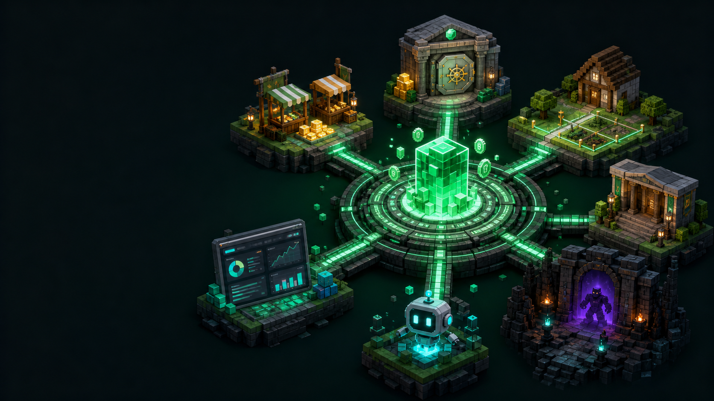

# KS-Series Player Guide

> [中文](KS-SERIES-PLAYER-README.md) | English

This guide covers ordinary player gameplay and commands. Administrator commands, compatibility internals, audit
records, and deployment instructions belong in the [full technical report](KS-SERIES-REPORT.en.md).

## Quick Start

```text
/kseco gui                  Open the economy hub
/market                     Open the player market
/balance                    Check your balance
/kseco prices               View official prices and trends
/kseco web                  Get the player Web panel link
/map                        Get the world map link
/title                      Open the title GUI
```

If an entry says that a feature is unavailable, the server owner has disabled that module or feature gate.



## Player Permissions

The exact permission setup is controlled by the server owner. A normal player commonly has:

```text
kseco.market
kseco.trade
kseco.storage
kseco.exchange
kseco.limitedsale
kseco.balance
kseco.politic.appeal
kshwp.use
kshwp.note
ksinherit.use
itemedit.refine
itemedit.design
kstitle.use
kscompat.bot.use
kscompat.bot.storage
```

## Economy Commands

| Command | Aliases | Permission | Use |
|---|---|---|---|
| `/kseco gui` | `/kse gui`, `/eco gui` | none | Open the economy hub. |
| `/kseco web` | `/kse web`, `/eco web` | none | Get the player Web panel. |
| `/kseco prices` | `/kse prices`, `/eco prices` | none | View buyback prices, trends, and tax information. |
| `/market` | `/mkt`, `/ah` | `kseco.market` | Browse, list, buy, and use official buyback. |
| `/trade <player>` | `/deal` | `kseco.trade` | Start a player trade. |
| `/trade quote <player>` | `/deal quote` | `kseco.trade` | Quote delivery cost for the held item. |
| `/trade send <player> [amount]` | `/deal send` | `kseco.trade` | Send the held item. |
| `/storage` | `/stash`, `/chest` | `kseco.storage` | Retrieve pending items, refunds, and compensation. |
| `/exchange` | `/barter`, `/swap` | `kseco.exchange` | Use configured exchanges. |
| `/limitedsale` | `/lsale`, `/timesale` | `kseco.limitedsale` | View limited-time stock. |
| `/balance` | `/bal`, `/money` | `kseco.balance` | View your balance. |
| `/mo` | `/majororder`, `/majororders` | none | View the server-wide major task. |

### Market behavior

- Listings preserve names, lore, enchantments, PDC, and other relevant item NBT for preview and settlement.
- Official buyback accepts only items in `official-buy.default-items`.
- Recent official SELL volume changes supply pressure. Oversupply lowers the buyback price; low recent supply raises
  it. Player purchases do not directly raise the official buyback price.
- A full inventory sends purchased or returned items to `/storage`.
- A failed transaction must refund currency or restore the item.

### Blind boxes

Open the blind-box entry from `/kseco gui`. The server may offer named pools, rarity tiers, weighted rewards, pity
counters, ten-pulls, enterprise-funded tickets, and NBT-preserving custom items. The GUI shows the configured cost and
result. When the inventory is full, the result goes to `/storage` instead of being dropped.

### Limited-time store

Use `/limitedsale` or the economy GUI to view a sale. A sale can have an opening time, closing time, global stock,
per-player limits, batch purchases, and box purchases bound to a configured pool. Stock and payment are settled as one
operation. A failed delivery is recoverable through storage or a refund according to the server configuration.

### Compensation

The economy GUI includes **Server Compensation** when an active plan is available. Each plan can be claimed once per
player and may contain replacement items, a quantity, an expiry time, and a custom message. Full inventory sends the
items to `/storage`.

## Banks, Enterprises, Tax, and Politics

These systems are optional `ks-Eco` Extra modules and may be disabled by the server owner.

- **Bank**: use the bank Web panel or its GUI for deposits, term deposits, loans, and interest. The central bank sets
  the macro rates; commercial banks serve players.
- **Enterprise**: create or join an enterprise, publish or bid on projects, and receive settlement through the
  enterprise public account when enabled.
- **Tax**: transaction, enterprise, interest, and penalty tax are applied by the configured rates. The actual rate is
  always the server's current configuration.
- **Politics**: eligible players can view proposals, submit appeals, vote, and use enabled office or legislation
  entries.

## Land, Property, and Dungeons

Use `/land` for plots, homes, trusted players, and property actions. Use `/dungeon` for the lobby, party, tickets,
revives, and completion rewards. Dungeon preparation may be purchased or gathered, while combat proofs and key
progression are intended to come from successful encounters rather than blind boxes or trading.

## Map

Use `/map` to get the Web map. The map can show explored terrain, dimensions, online players, and your notes. Private
notes remain private. A server may require an authenticated link from `/map` for adding notes or refreshing an area.

## Items, Titles, Skills, and Inheritance

- `/design` opens the player item designer when `KS-ItemEditor` is enabled.
- `/refine` opens weapon refinement when the server has configured a refinement voucher.
- `/title` opens the title interface when `ks-Title` is enabled.
- Passive skills and RPG abilities are configured by the server; player-facing descriptions are shown by the item or
  RPG GUI.
- `/inherit open` opens the cross-version item storage GUI when the migration system is enabled.

## KSBot

KSBot remains available as a player-facing feature when the server enables it. Use the server-provided bot interface
to inspect or control your permitted bot actions. Ownership checks, action limits, cooldowns, and storage rules are
enforced by the plugin; administrator bot commands are intentionally excluded from this guide.

## Design Principles Players Can Feel

The market and official buyback serve different purposes: the market discovers player-to-player prices, while the
official system provides a bounded liquidity outlet. Blind boxes, limited sales, and compensation are separate so a
random reward, a scheduled stock event, and a guaranteed service recovery do not share confusing rules. Item NBT and
storage queues protect the result of a successful transaction when the player's inventory is full.

For the administrator command list and implementation details, use the [full report](KS-SERIES-REPORT.en.md). For the
Chinese player version, use [KS-SERIES-PLAYER-README.md](KS-SERIES-PLAYER-README.md).
