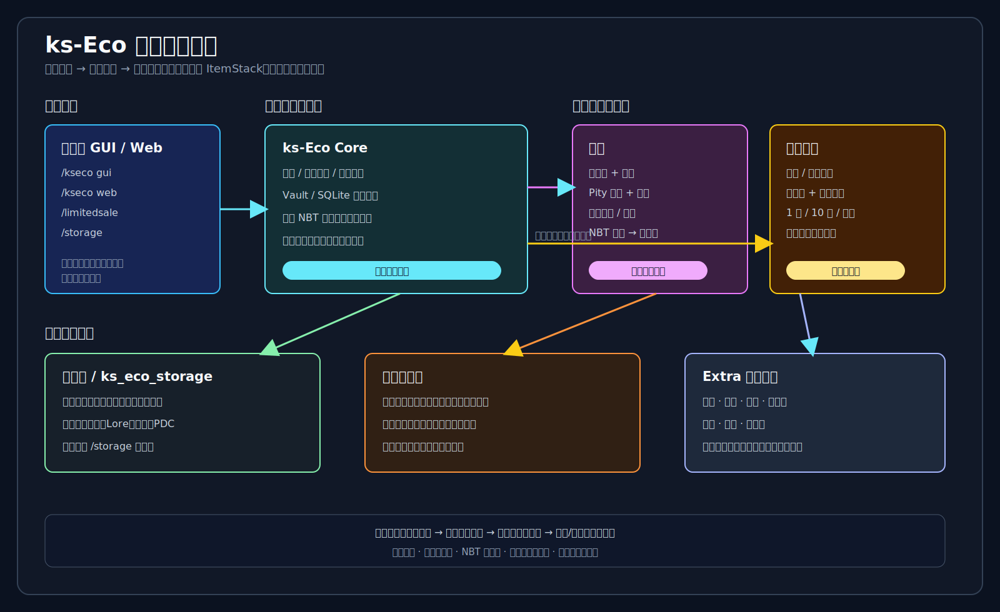

# ks-Series 全插件报告

> 生成日期：2026-07-15  
> 适用服务端：LeavesMC 1.21.11（Paper 1.21 分支）  
> 资料来源：当前源码、`plugin.yml`、模块 README、配置文件、`docs/CODEX_MEMORY.md`、`docs/CODEBASE_MAP.md` 和 `test_results/`。

## 1. 报告范围

当前仓库共有 **19 个 Maven 模块**：

- **13 个独立 Bukkit/Paper 插件**：可以直接作为 JAR 放入 `plugins/`。
- **6 个 ks-Eco Extra 模块**：不是 Bukkit 独立插件，不应放在 `plugins/` 根目录，而应放入 `plugins/ks-Eco/extra/`，由 `ks-Eco` 的 `ExtraModuleLoader` 运行时加载。

报告中的命令和权限以当前 `src/main/resources/plugin.yml` 为准；Extra 模块没有自己的 `plugin.yml` 和独立权限节点，它们通过 `ks-Eco` 的命令、Web 面板、功能开关和业务角色控制。

## 2. 总体架构

```text
LeavesMC 1.21.11
├─ ks-core                         Web 网关、Token、SQLite、路由、公告
├─ ks-Eco                          经济核心、GUI、Web、Extra 宿主
│  └─ plugins/ks-Eco/extra/
│     ├─ ks-Eco-bank                银行与货币供应
│     ├─ ks-Eco-enterprise          企业与招投标
│     ├─ ks-Eco-tax                 税收与处罚
│     ├─ ks-Eco-RealEstate          土地、房屋、领地保护
│     ├─ ks-Eco-RealEstateDungeon   副本、队伍、复活费、房产
│     └─ ks-Eco-politic              元老院、选举、提案、立法
├─ ksHWP                            Web 世界地图
├─ KS-ItemEditor                    GUI/Web 物品编辑与精炼
├─ KS-ItemSteal                     Boss/PvP 无损缴械
├─ ks-Inherit                       跨版本物品继承
├─ ks-Skill                         被动技能触发引擎
├─ ks-Title                         称号、属性、动画、条件解锁
├─ ks-Compat                        外部插件兼容与 Leaves KSBot
├─ ks-BotGuard                      Leaves ServerBot 事件保护
├─ ks-BossCombat                    Frostbound Boss 战斗规则
├─ ks-Maintenance                   维护模式
└─ ks-Sentinel                      管理员高危指令审计
```

### 2.1 部署边界

| 位置 | 应放置内容 |
|---|---|
| `test_1_21/plugins/` | 13 个独立插件 JAR，包括 `ks-core`、`ks-Eco`、`ksHWP`、`ks-Title` 等 |
| `test_1_21/plugins/ks-Eco/extra/` | 6 个 Extra JAR |
| `plugins/ks-core/` | 核心 Web 和共享 SQLite 数据 |
| `plugins/ks-Eco/` | 经济配置、市场数据、`dungeon_schematics/` 等 |

Extra 模块需要完整重启才能可靠重置类加载器；只执行 `plugman reload` 不能视为 Extra 部署成功。

### 2.2 依赖关系

```text
ks-core
├─ ks-Eco
│  └─ 6 个 ks-Eco Extra
├─ ks-Compat
├─ ksHWP
├─ ks-Sentinel
├─ ks-Title
├─ ks-Inherit
└─ KS-ItemEditor（可选 Web/网关集成）

外部软依赖：Vault、FastAsyncWorldEdit、WorldEdit、MythicMobs、MMOItems、
ItemsAdder、PlaceholderAPI、LuckPerms、OpenInv、Multiverse-Core 等。
```

## 3. 模块清单

版本栏同时列出 POM 和 `plugin.yml`，用于识别当前工程中的版本漂移。

| 模块 | 类型 | POM / manifest 版本 | 主类或 Extra 入口 | 主要职责 |
|---|---|---:|---|---|
| `ks-core` | 独立插件 | 1.1.0 / 1.1.0 | `org.kscore.KsCore` | Web 网关、路由、鉴权、共享数据 |
| `ks-Eco` | 独立插件 | 1.1.0 / 1.2.0 | `org.kseco.KsEco` | 经济、市场、GUI、Extra 宿主 |
| `ksHWP` | 独立插件 | 1.1.0 / 1.2.0 | `org.kshwp.KsHWP` | Web 世界地图和瓦片服务 |
| `KS-ItemEditor` | 独立插件 | 1.5.0 / 1.5.0 | `org.itemedit.ItemEditor` | 物品编辑、设计器、精炼 |
| `KS-ItemSteal` | 独立插件 | 1.0.2 / 1.0.2 | `com.steal.ItemSteal` | 无损夺取和归还武器 |
| `ks-Inherit` | 独立插件 | 1.0.0 / 1.0.0 | `org.ksinherit.KsInherit` | 跨版本物品存储与审阅 |
| `ks-Skill` | 独立插件 | 1.0.0 / 1.0.0 | `org.ksskill.KsSkill` | 被动技能触发和 MythicMobs 施放 |
| `ks-Title` | 独立插件 | 1.0.0 / 1.0.0 | `org.kstitle.KsTitle` | 称号、属性、条件、动画 |
| `ks-Compat` | 独立插件 | 1.0.0 / 1.0.0 | `org.kseries.compat.KsCompat` | 外部兼容、Leaves KSBot |
| `ks-BotGuard` | 独立插件 | 1.0.0 / 1.0.0 | `org.kseries.botguard.KsBotGuard` | 防止 ServerBot 触发 MMO 玩家数据错误 |
| `ks-BossCombat` | 独立插件 | 1.0.0 / 1.0.0 | `org.kseries.bosscombat.KsBossCombat` | Frostbound Boss 武器适配规则 |
| `ks-Maintenance` | 独立插件 | 1.0.0 / 1.0.0 | `org.kseries.maintenance.KsMaintenance` | 维护模式和绕过权限 |
| `ks-Sentinel` | 独立插件 | 1.0.0 / 1.0.0 | `org.kssentinel.KsSentinel` | 高危指令审计和 Web 查询 |
| `ks-Eco-bank` | Extra | 1.1.0 | `org.kseco.extra.bank.BankExtra` | 央行、商业银行、M0/M1/M2 |
| `ks-Eco-enterprise` | Extra | 1.1.0 | `org.kseco.extra.enterprise.EnterpriseExtra` | 企业、公户、招投标、分红 |
| `ks-Eco-tax` | Extra | 1.1.0 | `org.kseco.extra.tax.TaxExtra` | 税率、阶梯税、罚单 |
| `ks-Eco-RealEstate` | Extra | 1.1.0 | `org.kseco.extra.realestate.RealEstateExtra` | 区域、地块、房屋、保护 |
| `ks-Eco-RealEstateDungeon` | Extra | 1.0.0 | `org.kseco.extra.realestatedungeon.RealEstateDungeonExtra` | 副本实例和副本房产 |
| `ks-Eco-politic` | Extra | 1.0.0 | `org.kseco.extra.politic.PoliticExtra` | 元老院、选举、提案、立法 |

> `ks-Eco` 与 `ksHWP` 的 Maven 版本为 1.1.0，但当前 manifest 为 1.2.0。发布前应统一 POM、JAR 文件名、README 和 `plugin.yml` 的版本号。

## 4. 独立插件详解

### 4.1 ks-core：核心 Web 网关

**功能**

- 内嵌 HTTP 服务，统一承载各插件 Web 页面和 REST API。
- 通过最长 URL 前缀匹配分发到已注册插件。
- 提供玩家 Token、管理员 Token、续期、失效和 Bearer 鉴权。
- 管理共享 SQLite 连接和跨插件 `KsPluginBridge`。
- 提供公告栏 `/announce`，支持普通公告、法律动态和投票信息。

**命令与权限**

| 命令 | 别名 | 权限 | 作用 |
|---|---|---|---|
| `/kscore status` | `/ksc status` | `kscore.admin` | 查看网关状态、路由、会话和已注册插件 |
| `/kscore reload` | `/ksc reload` | `kscore.admin` | 重载 Web 配置 |
| `/announce` | `/ann`、`/announcements`、`/bulletin`、`/gonggao` | `kscore.web` | 查看公告栏 |

| 权限 | 默认 |
|---|---|
| `kscore.admin` | OP |
| `kscore.web` | true |

默认端口由当前配置决定；项目记忆中的生产端口为 `58578`，测试端口为 `8123`。所有受保护 Web API 使用 `Authorization: Bearer <token>`。

### 4.2 ks-Eco：经济核心

详见第 5 节。这里列出玩家和管理员直接使用的命令。

| 命令 | 别名 | 权限 | 作用 |
|---|---|---|---|
| `/kseco [web]` | `/kse`、`/eco` | 无独立节点 | 打开玩家经济入口或获取面板地址 |
| `/market` | `/mkt`、`/ah` | `kseco.market` | 市场 GUI：浏览、挂单、购买、官方收购 |
| `/trade <玩家>` | `/deal` | `kseco.trade` | 玩家间交易、物流报价和发送 |
| `/storage` | `/stash`、`/chest` | `kseco.storage` | 领取已购、退回或补偿物品 |
| `/exchange` | `/barter`、`/swap` | `kseco.exchange` | 物品兑换 GUI |
| `/limitedsale` | `/lsale`、`/timesale` | `kseco.limitedsale` | 限时直售 |
| `/balance` | `/bal`、`/money` | `kseco.balance` | 查询余额 |
| `/politic [gui\|appeal <提案ID>]` | `/kspolitic`、`/senate` | 提案呼吁需要 `kseco.politic.appeal` | 政治身份、提案、投票 |
| `/dungeon` | `/ksdungeon`、`/raid` | 由副本 Extra 提供 | 副本大厅 |
| `/land` | `/myland`、`/myplot` | 由房地产 Extra 提供 | 地块列表和信任管理 |
| `/house ...` | `/myhouse` | 由房地产 Extra 提供 | 测量、登记、查询和出售房屋 |
| `/kseco-admin reload\|status` | `/ksecoadmin`、`/ecoadmin` | `kseco.admin` | 管理状态、重载配置 |
| `/kseco-admin force-price <材质> <价格>` | 同上 | `kseco.admin` | 写入强制定价 |
| `/kseco-admin void-trade <材质> <数量> <价格> <BUY\|SELL>` | 同上 | `kseco.admin` | 记录虚空交易，调节市场供需 |
| `/exchangeadmin` | `/exadmin`、`/swapadmin` | `kseco.admin` | 管理兑换规则 |
| `/blindboxadmin` | `/bbadmin`、`/blindbox-admin` | `kseco.admin` | 管理盲盒卡池和 NBT 战利品 |
| `/limitedsaleadmin` | `/lsaleadmin`、`/timesaleadmin` | `kseco.admin` | 管理限时直售商品 |
| `/mo` | `/majororder`、`/majororders` | 默认 | 查看全服主任务 |

| 权限 | 默认 | 作用 |
|---|---|---|
| `kseco.admin` | OP | 经济管理、价格、兑换、盲盒、限时销售 |
| `kseco.market` | true | 市场 |
| `kseco.trade` | true | 玩家交易 |
| `kseco.storage` | true | 暂存箱 |
| `kseco.exchange` | true | 兑换 |
| `kseco.limitedsale` | true | 限时直售 |
| `kseco.balance` | true | 余额查询 |
| `kseco.politic.appeal` | true | 合资格玩家发起提案呼吁 |

#### ks-Eco 完整管理员命令

以下命令均需要 `kseco.admin`。`/kseco-admin` 的别名是 `/ksecoadmin` 和 `/ecoadmin`。

| 命令 | 作用 |
|---|---|
| `/kseco-admin web` | 获取管理员 Web 面板 |
| `/kseco-admin reload` | 重载经济配置、功能门控、配方快照和价格刷新任务 |
| `/kseco-admin reload extras` | 安全重载 ks-Eco Extra 模块 |
| `/kseco-admin status` | 查看挂单、暂存箱、Vault 和 Extra 状态 |
| `/kseco-admin force-price <物品材质> <价格>` | 强制设置官方收购价 |
| `/kseco-admin void-trade <物品材质> <数量> <单价> <BUY\|SELL>` | 注入管理交易；真实模式下 SELL 会影响供需，BUY 不制造官方需求 |
| `/kseco-admin give <玩家> <金额>` | 增加玩家余额 |
| `/kseco-admin take <玩家> <金额>` | 扣除玩家余额 |
| `/kseco-admin set <玩家> <金额>` | 设置玩家余额 |
| `/exchangeadmin` | 配置官方兑换规则，支持多输入、多输出和完整 NBT 物品 |
| `/blindboxadmin` | 管理盲盒卡池、稀有度、权重、保底和 NBT 战利品 |
| `/limitedsaleadmin` | 管理限时直售商品和库存 |
| `/kseco-admin economyreset` | 查看可重置的数据类别 |
| `/kseco-admin economyreset preview <类别\|all>` | 预览将要清理的数据量 |
| `/kseco-admin economyreset confirm <类别\|all>` | 先自动备份，再执行数据清理 |
| `/kseco-admin economyreset backups` | 查看可回档备份 |
| `/kseco-admin economyreset rollback <备份文件名>` | 先备份当前状态，再回档指定备份 |

经济重置类别包括 `core`、`bank`、`tax`、`realestate`、`dungeon`、`politic`、`blindbox` 和 `audit`。其中 `audit` 是 ks-Eco 自己的经济操作记录，不等同于独立的 `ks-Sentinel` 指令审计插件。

### 4.3 ksHWP：Web 世界地图

提供 Canvas 瓦片地图、多世界切换、在线玩家位置、个人备注、管理员公开标记和 Shift 框选坐标。房地产模块通过 `GET /kSHWP/api/tile` 和 `KsReMap` 复用地图图层。

| 命令 | 别名 | 权限 | 作用 |
|---|---|---|---|
| `/map [hidden]` | `/worldmap` | `kshwp.use`；隐藏模式需 `kshwp.hidden` | 获取地图链接或隐藏玩家位置 |
| `/mapnote add <文本>` | `/mn add` | `kshwp.note` | 添加当前位置备注 |
| `/mapnote list` | `/mn list` | `kshwp.note` | 查看个人备注 |
| `/mapnote delete <ID>` | `/mn delete` | `kshwp.note` | 删除备注 |
| `/kshwp reload\|status` | `/hwp` | `kshwp.admin` | 重载配置、查看状态 |
| `/kshwp forcerender [世界]` | `/hwp forcerender` | `kshwp.admin` | 强制渲染已加载区域 |
| `/kshwp forcerender-area <世界> <x1> <z1> <x2> <z2>` | — | `kshwp.admin` | 强制渲染范围 |
| `/kshwp prerender <世界>` | — | `kshwp.admin` | 预渲染世界 |
| `/kshwp cache` | — | `kshwp.admin` | 查看缓存 |
| `/kshwp clearcache [世界]` | — | `kshwp.admin` | 清除缓存 |

权限：`kshwp.admin`（OP）、`kshwp.use`（默认 true）、`kshwp.note`（默认 true）、`kshwp.hidden`（OP）。

### 4.4 KS-ItemEditor：物品编辑器

支持 GUI 编辑名称、Lore、原版附魔上限、自定义模型、FotiaEnchantment 数据、玩家武器精炼和 Web 物品设计器。软连接 `ItemsAdder`、`FotiaEnchantment`、`MythicMobs`，缺少外部插件时对应功能降级。

| 命令 | 别名 | 权限 | 作用 |
|---|---|---|---|
| `/itemedit [web\|reload]` | `/ie`、`/itemeditor` | `itemedit.admin` | 管理员编辑手持物品、获取 Web 链接或重载 |
| `/refine` | `/ref` | `itemedit.refine` | 打开武器精炼 GUI，消耗兑换券 |
| `/design [load <模板码>]` | `/designer`、`/wedit` | `itemedit.design` | 打开设计器或加载模板 |

权限：`itemedit.admin`（OP）、`itemedit.refine`（默认 true）、`itemedit.design`（默认 true）。

### 4.5 KS-ItemSteal：无损物品夺取

为 Boss 战或 PvP 提供临时缴械。物品从玩家身上转移到插件维护的归还流程，目标被击杀或管理员操作后恢复，设计目标是“不丢失原始 NBT”。MythicMobs 可以通过命令机制调用夺取。

| 命令 | 权限 | 作用 |
|---|---|---|
| `/itemsteal steal <thiefUUID> <victimUUID>` | `itemsteal.admin` | 由 Boss/管理员执行夺取 |
| `/itemsteal givebow <玩家>` | `itemsteal.admin` | 发放窃魂之弓 |
| `/itemsteal return <thiefUUID>` | `itemsteal.admin` | 强制归还 |
| `/itemsteal reload` | `itemsteal.admin` | 重载配置 |

权限：`itemsteal.admin`（OP）。

### 4.6 ks-Inherit：跨版本物品继承

用于 1.20.6 到 1.21.11 的迁服。玩家在 GUI 箱子提交物品，插件以 `ItemStack.serializeAsBytes()` 保存完整 NBT，管理员在 Web 审阅后批准、拒绝或发放。

| 命令 | 权限 | 作用 |
|---|---|---|
| `/inherit` | 无 | 显示帮助 |
| `/inherit open` | `ksinherit.use` | 打开物品保存 GUI |
| `/inherit slots <玩家> <数量>` | `ksinherit.admin` | 设置 1-54 个可用槽位 |
| `/inherit token` | 对应使用权限 | 获取玩家或管理 Web 链接 |
| `/inherit reload` | `ksinherit.admin` | 导入 `items_new.db` |
| `/inherit testitem` | `ksinherit.admin` | 创建复杂测试物品 |

权限：`ksinherit.use`（默认 true）、`ksinherit.admin`（OP）。OpenInv 可选，用于离线玩家发放。

### 4.7 ks-Skill：被动技能触发引擎

技能配置在 `ks-Skill/src/main/resources/skills.yml`，每条技能由触发器、概率、冷却、条件、MythicMobs 技能和绑定来源组成。支持：

- `ON_DAMAGED`、`ON_ATTACK`、`ON_KILL`、`ON_INTERVAL`、`ON_SNEAK`。
- 称号绑定、权限绑定、物品 PDC 标记绑定和指令授予。
- 世界限制、伤害类型限制、概率判定和内部冷却。
- 通过 MythicMobs 施放视觉、粒子、伤害或控制效果。

| 命令 | 权限 | 作用 |
|---|---|---|
| `/ksskill list [玩家]` | `ksskill.admin` | 列出技能或玩家生效技能 |
| `/ksskill grant <玩家> <技能ID>` | `ksskill.admin` | 授予技能 |
| `/ksskill revoke <玩家> <技能ID>` | `ksskill.admin` | 撤销技能 |
| `/ksskill test <玩家> <技能ID>` | `ksskill.admin` | 忽略概率/冷却强制施放 |
| `/ksskill reload` | `ksskill.admin` | 重载 `skills.yml` |

权限：`ksskill.admin`（OP）。

### 4.8 ks-Title：自研称号系统

取代 PlayerTitle，提供称号定义、购买、佩戴、玩家持有状态、属性加成、条件解锁、动画帧、ItemsAdder 图片字体、TAB/PlaceholderAPI 集成和 Web 管理。标题内容可通过 `ks-Title` API 供其他插件读取。

| 命令 | 权限 | 作用 |
|---|---|---|
| `/title` | `kstitle.use` | 打开浏览、佩戴、购买 GUI |
| `/title title <add\|del\|list\|desc\|require\|edit> ...` | `kstitle.admin` | 管理称号定义 |
| `/title player <add\|del\|set\|stop\|list> <玩家> [id]` | `kstitle.admin` | 管理玩家持有和佩戴 |
| `/title buff <add\|del\|edit\|list> ...` | `kstitle.admin` | 管理属性加成 |
| `/title frame <add\|clear\|remove> ...` | `kstitle.admin` | 管理动画帧 |
| `/title web` | `kstitle.admin` | 获取 Web 管理令牌 |
| `/title help` | `kstitle.use` | 查看帮助 |

权限：`kstitle.use`（默认 true）、`kstitle.admin`（OP）。

### 4.9 ks-Compat：外部兼容平台与 KSBot

`ks-Compat` 是兼容层，不是单纯的命令插件。当前代码包括：

- Leaves `ServerBot` 反射桥接和玩家拥有关系。
- Bot 数量、并发动作、重复类型、间隔、冷却和重复次数限制。
- Bot 独立恢复物品存储。
- FotiaEnchantment 金钱耐久兼容、Vulcan ArmorStand 兼容、僵尸猪灵仇恨处理。
- 与 `ks-Eco`/Vault 的经济桥接和 Web 状态页。

| 命令 | 权限 | 作用 |
|---|---|---|
| `/kscompat status` | `kscompat.admin` | 查看兼容模块状态 |
| `/kscompat reload` | `kscompat.admin` | 重载兼容配置 |
| `/kscompat web` | `kscompat.admin` | 获取兼容 Web 页面 |
| `/ksbot ...` | `kscompat.bot.use` 或管理员节点 | 创建、查询、控制、传送和回收玩家 Bot |
| `/ksbotstorage [open\|status]` | `kscompat.bot.storage` | 打开或查询自己的 Bot 恢复物品箱 |

权限：`kscompat.admin`（OP）、`kscompat.bot.use`（默认 false）、`kscompat.bot.admin`（OP）、`kscompat.bot.slots`（OP）、`kscompat.bot.tp.others`（默认 false）、`kscompat.bot.storage`（默认 true）。

### 4.10 ks-BotGuard：Leaves ServerBot 保护

Leaves 的 `ServerBot` 事件可能带有 Player-like 对象，但不一定是标准 `PlayerEvent`。BotGuard 包装 MythicLib/MMOCore 的监听器，在识别到 Bot 事件时跳过可能访问玩家数据的监听器，同时保留 Leaves Bot 自身的伤害和动作逻辑。

保护范围可按配置切换：伤害、实体伤害、方块破坏/放置、交互、容器、投掷、钓鱼、换手、吃物品、射箭、潜行、经验变化、载具和 Bot 发射的投射物。插件禁用时会清理包装；受保护插件禁用时只丢弃其包装，避免旧监听器被错误恢复。

| 命令 | 权限 | 作用 |
|---|---|---|
| `/ksbotguard reload` | `ksbotguard.reload` | 重载保护配置 |
| `/ksbotguard status` | `ksbotguard.reload` | 查看保护状态 |
| `/ksbotguard protect <target> <on\|off>` | `ksbotguard.reload` | 单独切换保护项 |

权限：`ksbotguard.reload`（OP）。

### 4.11 ks-BossCombat：Boss 战斗规则

当前实现专门服务 `Frostbound_Conductor`：

- 只处理带 `Frostbound_WeaponAdaptation` scoreboard tag 的 Boss。
- 通过 MMOItems 反射识别主手武器类型。
- 默认对 `HAMMER`、`GREATHAMMER`、`SPEAR`、`LANCE` 的伤害乘以 `0.5`。
- 同时支持玩家直接攻击和玩家发射的投射物。
- MMOItems 不存在或 API 不匹配时优雅停用适配，不影响 Boss 本体。

当前没有游戏命令和自有权限节点，配置位于 `ks-BossCombat/src/main/resources/config.yml`。队伍机制成功后可以移除 Boss tag，形成短暂的武器适配解除窗口。

### 4.12 ks-Maintenance：维护模式

提供服务器维护门控。开启后普通玩家不能加入，OP 或拥有 bypass 权限的玩家可以进入；管理员可查看状态、切换模式、重载并主动踢出玩家。

| 命令 | 权限 | 作用 |
|---|---|---|
| `/ksmaintenance on` | `ksmaintenance.admin` | 开启维护 |
| `/ksmaintenance off` | `ksmaintenance.admin` | 关闭维护 |
| `/ksmaintenance status` | `ksmaintenance.admin` | 查看状态 |
| `/ksmaintenance reload` | `ksmaintenance.admin` | 重载配置 |
| `/ksmaintenance kick` | `ksmaintenance.admin` | 踢出不满足维护条件的玩家 |

别名：`/maintenance`、`/ksmaint`。权限：`ksmaintenance.admin`（OP）、`ksmaintenance.bypass`（OP）。

### 4.13 ks-Sentinel：管理员行为审计

监听玩家和控制台指令，在 MONITOR 阶段记录尝试过的指令，使用 25+ 条高危规则判定风险，异步批量写入独立 SQLite。支持目标玩家识别：对自己执行的操作可降低风险，对其他玩家的操作提高风险。

| 命令 | 权限 | 作用 |
|---|---|---|
| `/sentinel token` | `kssentinel.admin` | 获取 Web 审计面板链接 |
| `/sentinel log [玩家] [条数]` | `kssentinel.admin` | 游戏内查看最近日志 |
| `/sentinel exclude list` | `kssentinel.admin` | 查看排除规则 |
| `/sentinel exclude add <指令前缀>` | `kssentinel.admin` | 添加不记录的前缀 |
| `/sentinel exclude remove <id>` | `kssentinel.admin` | 删除排除规则 |

权限：`kssentinel.admin`（OP）。Web 路由为 `/ks-Sentinel`，用于按风险、执行者、关键字分页筛选，并管理高危规则和排除规则。

## 5. ks-Eco 专题：模块设计与实现

### 5.1 产品定位

`ks-Eco` 不是单一的金币插件，而是一个可装配的服务器经济平台：

1. 核心层负责市场、价格、结算、物品存储、GUI、Web 和审计。
2. Extra 层负责银行、企业、税收、房地产、副本和政治等领域业务。
3. `ks-core` 负责共享数据库、网关、Token 和跨插件桥接。
4. 游戏内入口适合玩家重复操作，Web 入口适合管理员批量配置、筛选和宏观监控。



### 5.2 核心模块

| 模块 | 实现对象 | 已实现功能 |
|---|---|---|
| 市场挂单 | `ListingManager`、`MarketManager` | SELL/BUY 挂单、数量扣减、过期、撤单、玩家购买、商品房 Tab |
| 官方市场 | `OfficialBuyManager`、`OfficialMarketSweepManager`、`OfficialWarehouseManager` | 官方收购、低价保护收购、仓库入库、周期扫描 |
| 定价 | `PriceEngine`、`MarketValueService` | 基准价、供需、波动、官方买卖价、配方估值、附魔估值 |
| 物品持久化 | `StorageManager`、`ShulkerBoxParser` | 完整 NBT、潜影盒递归估值、背包满时转暂存箱 |
| 玩家交易 | `TradeManager`、`TransferManager`、`TransportManager` | 双方确认、物品和货币交换、物流报价和发送 |
| 盲盒 | `BlindBoxManager` | ITEM/MATERIAL/EQUIPMENT 卡池、稀有度、权重、保底、企业等级门槛 |
| 限时销售 | `LimitedSaleManager` | 限量库存、限时直售、管理 GUI、NBT 商品 |
| 兑换 | `ExchangeManager` | 兑换规则、材料消耗、产物发放和暂存箱兜底 |
| 补偿 | `CompensationManager`、`CompensationGui` | 管理员创建方案、一次性领取、过期和替换物品 |
| 主任务 | `MajorOrderManager`、`MajorOrderCommand` | 全服目标、进度、奖励和状态 |
| Web | `EcoWebHandler`、`web/admin.html`、`web/player.html`、`web/test.html` | 管理端、玩家端、资产、市场、Extra、统计、审计和本地故障场景测试 |
| 模块门控 | `ExtraModuleLoader`、`FeatureGateManager` | Extra 动态加载、失败隔离、功能离线状态、Web 可见性 |

#### 盲盒系统：概率、保底和完整物品发放

盲盒不是把若干材料随机发给玩家的临时脚本，而是一个可配置的奖池系统。`BlindBoxManager` 为每个卡池保存池类型、价格、启用状态、奖品列表和保底规则；奖品支持 ITEM、MATERIAL、EQUIPMENT 等池类型，使用稀有度和权重进行抽取。管理员可以通过 `/blindboxadmin` 的 GUI 创建卡池、编辑抽奖规则、放入手持的完整 NBT 物品，并为奖品设置数量、稀有度、权重和附加物品。

一次普通抽取的流程是：先检查卡池状态和玩家/企业资格，再扣除个人余额或企业公户；随后按权重抽取主奖品，解析附加奖品，更新对应的 pity 计数，最后把完整 `ItemStack` 发给玩家。连续多次没有获得指定等级时，pity 会把抽取范围提升到配置的稀有度，命中后重新计数。抽奖记录和保底计数都会持久化，避免重连或重复点击改变结果。

玩家可以单抽或十连；企业使用公户按次单抽，卡池可配置 `min_enterprise_level`，后端会在扣款前读取缓存等级并拒绝不满足要求的企业。购买式共享票券已从管理器、Web、游戏 GUI、建表和重置入口退役，历史表仅作为休眠遗留数据保留。奖励优先进入背包，背包放不下的部分进入 `/storage` 对应的暂存箱。限时商店也可以绑定一个盲盒池，先由限时商品完成扣款和库存结算，再调用不重复扣款的盲盒抽取流程。

#### 限时商店：库存、窗口和购买幂等

`LimitedSaleManager` 把限时商品拆成“商品定义、玩家购买计数、购买日志”三类数据。商品定义包含价格、总库存、已售数量、开始时间、结束时间、个人限购、启用状态、完整 NBT 商品，以及可选的整盒购买配置。管理员通过 `/limitedsaleadmin` 创建和编辑直售商品，也可以创建绑定盲盒池的限时盲盒。

玩家打开 `/limitedsale` 后先看到当前可见商品，再进入详情查看完整物品或盲盒奖池。直售商品支持购买 1 份或批量购买 10 份；满足条件的商品可以按整盒价购买 27 份。系统在购买时重新读取库存、开售窗口和个人购买量，并在一个数据库事务中更新库存、个人计数和购买日志；余额不足、库存变化、商品过期或发放失败都会退款或回滚已占用的计数。限时盲盒的价格只在限时商店侧扣除一次，抽奖失败时按成功次数结算并退还失败部分。

#### 补偿系统：运营发放和一次性领取

`CompensationManager` 用于处理服务器维护、活动补发、事故修复和定向物品发放，不把补偿伪装成普通市场收入。管理员在 `/kseco gui` 的补偿管理入口中用手持物品创建方案，然后设置方案名称、每人数量、有效天数、启用状态和替换物品；替换物品同样保存完整 NBT/PDC。方案可以停用、删除或在管理 GUI 中查看领取人数和截止时间。

玩家从 `/kseco gui` 的“服务器补偿”入口查看自己可领取的方案。每个方案通过唯一的 `(plan_id, player_uuid)` 记录保证每人只能成功领取一次；领取结算会把补偿物品和领取记录放进同一个 SQLite 事务，过期、停用、重复领取或数据库失败不会发放半份奖励。物品不直接塞进不可控的背包流程，而是先进入 `ks_eco_storage`，玩家再通过 `/storage` 领取，避免补偿领取时背包满造成丢失。

这三个模块的边界分别是：盲盒解决“概率和长期期待”，限时商店解决“明确价格下的窗口和稀缺库存”，补偿解决“运营纠错和一次性发放”。它们共用余额、NBT 序列化、暂存箱和事务结算，但不会互相复用错误的库存或领取记录。

### 5.3 Extra 模块设计

| Extra | 设计职责 | 关键实现 | 玩家入口 |
|---|---|---|---|
| 银行 | 央行-商业银行二级体系 | `CentralBankManager`、`BankManager`、`CbLoanManager`、`MoneySupplyTracker` | Web；银行 GUI |
| 企业 | 法人、公户、等级、招投标、采购、分红 | `EnterpriseLevelManager`、`EnterpriseManager`、`BiddingManager`、`QualificationChecker` | Web；企业 GUI |
| 税收 | 多税种、行业税率、阶梯、处罚 | `TaxManager`、`TaxRateManager`、`PenaltyManager` | Web；税务 GUI |
| 房地产 | 区域、地块、房屋、产权、保护 | `RealEstateManager`、`PlotProtectionListener`、`LandPerkManager` | `/land`、`/house`、市场 |
| 副本 | 实例、网格、队伍、贴图、刷怪、复活费 | `DungeonInstanceManager`、`DungeonGridAllocator`、`SchematicService`、`MythicSpawner` | `/dungeon` |
| 政治 | 身份、选举、提案、投票、立法门控 | `PoliticManager`、`ElectionEngine`、`ProposalManager`、`VoteManager` | `/politic`、公告栏、Web |

Extra 启动流程：读取 `META-INF/ks-eco-extra.properties` 的 `main-class`，建立独立类加载器，只有 `onEnable` 成功后才对 Web 和功能门控公开；禁用前先从 Web 隐藏；失败模块会移除并关闭类加载器。核心经济仍可在缺少某个 Extra 时启动。

### 5.4 数据和线程设计

**数据层**

- `ks-core` 统管共享 SQLite；`ks-Eco` 和 Extra 使用各自前缀表，跨模块通过明确的共享表和 Provider 接口连接。
- 市场、仓库、税收、企业、银行、政治和房产都有业务记录，支持审计和后台查询。
- 物品使用 `ItemStack.serializeAsBytes()` 保存为 Base64/BLOB，保留名称、Lore、附魔、属性、模型和 PDC。
- 房产登记、房屋产权转移、挂单领取、官方仓库入库和补偿领取使用事务或幂等状态，降低重复结算风险。

**线程边界**

| 服务器线程 | 工作线程 |
|---|---|
| Bukkit/Paper 活对象、玩家、背包、GUI、ItemStack、配方注册表、Vault | SQLite 读写、纯价格计算、聚合、排序、报表构造 |
| 物品和玩家状态先快照，再提交异步任务 | 只接收不可变快照，不捕获可变 Bukkit 对象 |
| 异步结果回主线程后再发物品、提示、声音和刷新 GUI | 不在事务中等待主线程回调 |

当前仍有待继续异步化的区域：采购订单、企业盲盒、部分银行/企业/投标/邀请/地产/税务 GUI，以及 SQLite 提交和外部 Vault 结算之间的持久化结算日志。购买式票券已退役，不再作为线程改造目标；限时销售和玩家盲盒单抽/十连批量路径已在 2026-07-16 完成首轮线程分离。

### 5.5 Web 与 GUI 设计

- Web 统一走 `ks-core` 网关，不让每个 Extra 自己开端口。
- `admin.html` 和 `player.html` 只保留结构，行为拆到 `web/assets/`，便于单独检查和缓存。
- 管理端提供市场挂单、价格、银行、企业、税收、房地产、副本、政治、补偿、审计等视图。
- 玩家端提供市场、资产、交易、房屋、投标、银行和副本状态。
- 真实世界地图与房地产区域共用 `ksHWP` 瓦片；房产预览可加载 3D 体素查看器，按区域分块请求并合并成场景。
- 本地 `web/test.html` 直接嵌入正式管理员/玩家页面，支持正常、空数据、API 故障和慢接口场景；预览数据只在 localhost 且 `preview=1` 时启用。

### 5.6 设计思路具体化

#### 1. 经济系统是“资源流动”而不是单纯发金币

`ks-Eco` 把资源分成三条可追踪的路径：玩家市场、官方收购和系统消耗。玩家市场负责发现价格，官方收购负责托底，兑换、盲盒、税收、物流费、土地和副本门票负责消耗货币或物品。这样资源不会只从刷怪/农场单向流入玩家钱包，而是形成“产出 → 交易 → 消耗 → 再生产”的循环。

#### 2. 价格系统把真实交易和运营干预分开

真实玩家卖给官方的 SELL 流水进入供需压力统计；测试模式产生的 `is_test` 流水只用于预览，永久排除出真实统计。管理员的 `force-price` 是明确的硬覆盖，`trendBias` 是缓慢的方向牵引，随机漂移是背景波动，三者职责不同，避免用一个“万能价格按钮”掩盖市场状态。

#### 3. NBT 完整性是跨系统契约

市场、交易、兑换、盲盒、暂存箱、补偿和物品继承都共享“完整 ItemStack 数据”这一契约。业务层只负责决定物品归属和数量，序列化层负责保留 NBT，结算层负责保证余额和物品变更成对发生。背包、GUI 和 Bukkit API 只能在服务器线程访问，数据库和纯计算才进入工作线程。

#### 4. Extra 模块是按需加载的业务插件

银行、企业、税收、房地产、副本和政治都有独立的业务边界，但共享 `ks-core` 数据和 `ks-Eco` 经济能力。模块加载失败时，核心经济继续运行，Web 只显示对应模块离线；模块成功启用后才对功能门控和页面公开。这样服主可以按玩法选择装配模块，不必为未使用的系统承担启动和维护成本。

#### 5. 房地产把“土地权”和“建筑权”拆开

购买地块代表获得土地使用权，房屋登记代表在地块中确认具体建筑范围。容积率只在登记房屋时消耗，允许一块地分成多套房屋；信任名单保护的是实际可操作范围，而不是简单把整块区域永久锁死。商品房市场只转移房屋产权，地块、企业成员和副本实例通过明确的关联字段处理。

#### 6. 副本用风险换取经济动力

副本不是一次性传送到固定地图，而是“模板 + 虚空网格 + 队伍 + 生命周期”的实例。门票、队伍人数、时间限制、复活费和房产权限共同决定风险；副本结束后实体、地形和副本房产按生命周期清理，避免世界无限膨胀。

#### 7. 管理功能强调可回滚和可解释

价格调整、经济重置、Extra 重载、盲盒卡池和余额操作都应留下可解释的状态或记录。经济重置会先备份，测试交易会标记 `is_test`，市场详情展示价格和趋势，Web 管理端使用实体抽屉和历史数据而不是只给一个“成功/失败”提示。运营者可以知道系统为什么变价、谁受到了影响，以及出错后如何恢复。

## RPG 演进规划（未上线）

服务器保持单一、长期的生存身份。MMOCore 仅承载受控的基础属性、资源与区域熟练度；
MMOItems 负责少量固定装备、配方与升级呈现；MMOInventory 仅保留两枚戒指和一个护符位。
MMOProfiles 继续卸载，避免其档案化背包、位置、生命和余额与领地、机器及经济系统冲突。

核心主动技能和账户绑定的战斗资格将收敛到未来的 `ks-RPG`，不与 MMOCore 技能栏并行。
第一个副本前先进行低负载的“遗迹前夜”：共享起步身份、区域精英、特殊资源点和不可交易的
协作印记；普通采集和机器自动化不作为通用 RPG 经验来源。首批副本限制为一个并发、四人队伍，
通过 MSPT、堆内存和 GC 数据确认容量后再提高并发。

### 已部署到测试服：第一批装备经济底座

`ks-RPG` 0.1.0 已提供材料目录与单向兑换命令。它先校验发起玩家的主背包、全部输入和输出空间，
再扣除材料并发放结果；MMOItems 不可用或物品 ID 缺失时会拒绝操作，不会扣料。首批比例为：
8 个 Field Scrap 换 1 个 Refined Alloy；4 个 Alloy 加 16 个红石换 1 个 Conductive Coil；
4 个 Coil 加 8 个紫水晶碎片换 1 个 Stabilized Core；2 个 Core 加 1 个回响碎片换 1 个 Relic Fragment。

已新增四档独立 `KS_*` 品质、五种材料、两枚戒指与一个护符。MMOInventory 通过新布局只开放两戒指
和一护符槽，旧默认布局保留数据但停止使用；MMOCore 的内建队伍、公会和默认状态栏均已关闭，以免与
现有副本队伍和未来 `ks-RPG` 技能层重复。该切片没有循环扫描、随机词条或异步数据库任务。

## 6. ks-Eco 模拟效果

本节描述“玩家操作后服务器会出现什么结果”，用于运营演示、验收和编写测试用例。

### 6.1 市场价格模拟

以当前配置中 `DIAMOND` 官方基准价 100、`WHEAT` 2、`IRON_INGOT` 10 为例。实际价格由真实官方收购流水、波动状态和管理端设置共同决定。当前机制已经不是旧的正弦波模型。

```text
供需压力 = clamp((近期真实卖量 - 历史基线) / 历史基线, -1, 1)
漂移值 = clamp(上一漂移 + 随机扰动 + 导向牵引 - 自然回归, -1, 1)
总偏移 = clamp(漂移值 × 波动上限 - 供需压力 × 波动上限, ±波动上限)
官方收购价 = round(基准价 × (1 + 总偏移), 2)
```

默认参数是波动上限 `±30%`、每次刷新随机步长标准差 `0.03`、导向牵引 `0.15`、自然回归 `0.05`、供需窗口 24 小时、基线回看 14 天、冷门物品默认基线 64。刷新间隔默认 60 分钟，但管理员可在 Web 端修改并热重载。

这里的“供需”只统计真实卖给官方的 SELL 流水：近期卖得比历史基线多是供过于求，价格下压；近期卖得比历史基线少是供不应求，价格上拉。旧记录滑出窗口后自然消退。`driftValue` 则是带均值回归的随机游走，`trendBias` 只能逐步牵引它，不能瞬间改价，也不能突破真实供需造成的总偏移上限。

模拟操作与效果：

| 操作 | 系统变化 | 玩家可见效果 |
|---|---|---|
| 大量出售小麦 | 小麦供给压力增加 | 官方收购价逐步下降，农场收益变低 |
| 一段时间几乎没人卖钻石 | 卖量低于历史基线，供需压力为负 | 官方收购价向上，鼓励玩家补充稀缺资源 |
| 管理员设置 `trendBias` | 后续刷新逐步牵引 `driftValue` | 可做运营导向，但不会瞬间跳价 |
| 管理员 `/kseco-admin void-trade ... BUY` | 记录 BUY 流水；官方只收购、不直售 | 不会制造虚假的官方需求上涨 |
| 管理员开启测试模式后执行 `void-trade` | 写入 `is_test` 测试流水并计算假设价格 | 只预览，不污染真实价格和供需统计 |
| 玩家低于保护价挂单 | 触发官方收购检查 | 合格挂单可被官方买入并进仓库，而不是简单拒绝 |
| 交易金额很小 | 适用 `min-tax` | 即使 2% 小于最低税额，也会按最低税额收税 |

仓库和挂单的实现效果是“物品不凭空消失”：背包满时进入 `/storage`，交易失败时异步退款或回滚，物品读取和写回仍在服务器线程完成。

### 6.2 银行和货币供应模拟

| 场景 | M0 | M1 | M2 | 预期现象 |
|---|---:|---:|---:|---|
| 玩家手持 10,000 金币 | 10,000 | 10,000 | 10,000 | 现金流通 |
| 存入 6,000 活期 | 4,000 | 10,000 | 10,000 | 现金转成活期，M1 总量不变 |
| 再存入 3,000 定期 | 1,000 | 7,000 | 10,000 | M2 仍包含活期和定期 |
| 央行 GRANT 注资商业银行 | 增加系统流动性 | 增加 | 增加 | 贷款和交易能力增强 |
| 央行收紧基准利率 | 不立即删除余额 | 不变 | 不变 | 新贷款成本上升，后续需求下降 |

商业银行受到央行利率区间约束，企业公户统一托管于 `CORP-BANK`，个人钱包和企业资产保持隔离。

### 6.3 企业、税收和政治闭环

```text
注册资本 → 企业公户 → 企业等级 → 招标/采购 → 中标预付款 → 分红/工资
       └→ 行业和利润 → 阶梯税率 → 税收记录/罚单
       └→ 政治提案 → 元老院表决 → 税率、央行、区域政策生效
```

示例：

1. 玩家注册一个农业私企，注册资本从所有者钱包扣除并进入企业公户。
2. 企业发布项目，其他企业或个人投标；企业投标需要达到预算 75% 的注册资本资格线。
3. 中标后企业获得预付款，采购和分红从公户结算。
4. 管理员设置企业等级；等级决定部分企业盲盒资格，并缩放企业名下农业/工业地块的百分比福利。
5. 农业行业可以配置独立税率；利润跨过阶梯后适用更高税率。
6. 开启 `legislative_mode` 后，直接改税率会被政治流程门控，必须通过提案、表决和颁布。

企业等级后续适合继续用于资格、容量和治理，而不是无条件提高伤害或直接送钱：可限制高阶采购/工程投标资格、并行项目与采购单数量、企业仓库容量、银行授信上限与抵押率、成员上限、分红频率或治理权限、城区地块购买资格，以及企业合同/副本难度层级。每项应用仍需独立配置，避免一个等级同时放大所有经济收益。

### 6.4 房地产和副本模拟

| 操作 | 结果 |
|---|---|
| 管理员划定 `RESIDENTIAL` 区域 | 产生区域基准价和容积率上限 |
| 玩家框选地块购买 | 获得土地使用权，不立即消耗房屋容积率；企业地块福利按企业等级倍率结算 |
| 用测量棒选两个角点并登记房屋 | AABB 重叠检查、容积率检查和产权写入在一次事务内完成 |
| 房屋挂牌 | 进入 `/market` 的商品房视图，可预览 3D 体素 |
| 房屋成交 | 转移房屋产权和相关权限，并按房屋税率收取一次契税 |
| 副本中登记安全屋/商店 | 房产表用 `instance_id` 区分副本实例，实例清理时级联删除 |
| 副本内第 n 次复活 | 默认费用 `200 × 1.8^(n-1)`，达到上限后拒绝复活 |

默认复活费用示例：第 1/2/3/5/10 次约为 200/360/648/2099/4640。

### 6.5 盲盒、补偿和主任务模拟

- 盲盒按池、稀有度和权重抽取，连续未获得高等级物品时由 pity 机制提供保底；玩家支持十连，企业按公户单抽并受最低企业等级限制。
- 抽到的完整 NBT 物品优先进入背包，背包不足时写入暂存箱；十连抽会逐次记录结果和保底推进，不能因为批量请求跳过计数。
- 限时商店可以把一个商品绑定到盲盒池：玩家看到的是限时商品的倒计时、库存和个人限购，购买成功后才从绑定池抽取；商店扣款与盲盒抽取失败分开处理，失败部分退款。
- 直售商品示例：总库存 100、个人限购 3、开售 24 小时。玩家购买第 1 份后库存变为 99、个人计数变为 1；第 4 次购买会在扣款前被拒绝，商品结束后详情页显示“已结束”。
- 盲盒示例：SSR 权重 2、SR 权重 12、R 权重 40，连续 50 次未命中 R 以上时触发保底。玩家背包满时，奖品进入 `/storage`，而不是静默丢失。
- 管理员可从手持物品创建补偿方案，设置数量、有效期、替换物品和启用状态；每个玩家只能成功领取一次。玩家点击领取后看到“已领取至暂存箱”，再次点击只会提示已经领取。
- 主任务可以把全服采集、交易或副本目标转成公共进度，并在完成后发放奖励，形成跨玩家的经济需求。

## 7. 权限组建议

以下是基于当前权限节点的 LuckPerms 分组示例。这里只给出分组策略，不会自动写入服务器权限数据库。

```text
ks-player
  kscore.web
  kseco.market
  kseco.trade
  kseco.storage
  kseco.exchange
  kseco.limitedsale
  kseco.balance
  kseco.politic.appeal
  kshwp.use
  kshwp.note
  ksinherit.use
  itemedit.refine
  itemedit.design
  kstitle.use
  kscompat.bot.storage

ks-builder-or-designer
  继承 ks-player
  itemedit.design
  kshwp.note

ks-moderator
  继承 ks-player
  ksmaintenance.bypass
  kscompat.bot.tp.others

ks-economy-admin
  kseco.admin
  kscore.admin

ks-content-admin
  itemedit.admin
  itemsteal.admin
  ksskill.admin
  kstitle.admin
  kshwp.admin

ks-security-admin
  kssentinel.admin
  ksbotguard.reload
  ksmaintenance.admin
  kscompat.admin

ks-bot-admin
  kscompat.bot.admin
  kscompat.bot.slots
  kscompat.bot.tp.others
  kscompat.bot.storage
```

建议把 `kseco.admin`、`kssentinel.admin`、`itemsteal.admin` 和 `ksmaintenance.admin` 分开授予，避免“会做内容配置”的管理员同时拥有经济干预、审计查看和维护踢人权限。

## 8. Web 面板和数据入口

| 面板 | 路由/入口 | 主要用户 |
|---|---|---|
| 核心公告 | `/announce` | 全体玩家 |
| 经济管理 | `/ks-Eco/admin` | 经济管理员 |
| 玩家经济 | `/ks-Eco/player` | 玩家 |
| 世界地图 | `/kSHWP` | 玩家、房产管理员 |
| 物品编辑 | `/IE` | 内容管理员、设计玩家 |
| 物品继承 | `/ks-Inherit/admin` | 迁服管理员 |
| 指令审计 | `/ks-Sentinel/admin` | 安全管理员 |

实际端口和 Token 有效期以 `ks-core/config.yml` 为准。不要把测试 Token、MCSM API Key、SQLite 数据库和生产备份打入部署包。

## 9. 构建、部署和验证

推荐构建顺序：

```text
ks-core → ks-Eco → 6 个 Extra → ksHWP/ItemEditor/ItemSteal/Inherit/
ks-Skill/ks-Title/ks-Compat/ks-BotGuard/ks-BossCombat/ks-Maintenance/ks-Sentinel
```

常用操作：

```powershell
.\build_all.ps1
cd ks-Eco
mvn clean package -DskipTests
```

当前 `build_all.ps1` 的 `$plugins` 列表包含 18 个模块，**尚未包含 `ks-BossCombat`**；因此“仓库有 19 个模块”和“一键脚本当前构建 18 个模块”是两个不同事实。BossCombat 需要单独在其目录构建，并按独立插件部署。

验证基线：

- `ks-Eco` 当前 Maven 构建可通过 `mvn clean package -DskipTests`。
- 22 个 Web JavaScript 模块通过 Node 语法和资源引用检查。
- 市场模拟脚本位于 `test_results/market_simulation.py`，现有记录为 65/65 通过。
- 房产 3D 地区预览曾验证 15 个预览瓦片、10,287 个方块合并，无浏览器控制台错误。
- 当前 `ks-Eco` 没有完整的自动化 Java 测试源；补偿 GUI 等部分功能完成静态审计和编译，但没有在本轮启动 Paper 做全流程实测。
- 企业等级与测试台变更已通过 `ks-Eco` clean install、RealEstate clean package 和桌面 Browser 回归；测试台四种场景、企业等级编辑、卡池等级限制和玩家锁定状态均无控制台错误。
- 部署前应构建、备份目标 JAR、核对 SHA-256；不应在未获明确要求时启动或重启 Paper。

## 10. 当前已知事项

1. `ks-Eco`、`ksHWP` 的 POM 和 manifest 版本不一致，应在发布前统一。
2. Extra JAR 必须位于 `plugins/ks-Eco/extra/`，放入 `plugins/` 根目录会被 Bukkit 当成独立插件扫描。
3. `build_all.ps1` 目前没有构建 `ks-BossCombat`，全量发布脚本需要补入该模块。
4. 仍需把采购订单、企业盲盒和更多 Extra GUI 的数据库操作移出服务器线程；限时销售和玩家盲盒批量路径已完成首轮分离。
5. 购买式企业票券已退役；若未来需要授权额度，必须按预算或定向奖励重新设计，不能恢复旧共享计数模型。
6. 仍需为 SQLite 提交和外部 Vault 结算之间的崩溃窗口增加持久化结算日志。
7. `ks-BossCombat` 的 Frostbound 武器适配依赖 MMOItems 运行时反射；未安装或版本不兼容时不会提供适配效果。
8. README、配置和实际构建产物的版本号应由一次发布流程统一生成，避免手工漂移。
